# LF Portfolio

This is my personal portfolio website, built to showcase my skills, projects, and experience as a frontend developer.

## 📁 Project Structure

LF-portfolio/
├── frontend/ # React-based portfolio site
├── backend/ # (Optional) backend for handling contact form, API, etc.
├── README.md

## 🧪 Tech Stack

**Frontend:**
- React
- Vite
- Tailwind CSS
- Framer Motion
- Custom animations and effects

**Backend (optional):**
- Node.js / Express

## 🚀 How to Run

### Frontend

cd react-portfolio
npm install
npm run dev

### Backend

cd backend
npm install express
node server.js

🌐 Live Demo
[(https://lf-creator.github.io/LF-portfolio/)]

📬 Contact
Feel free to reach out via LinkedIn.

## 📷 Screenshots

### Homepage
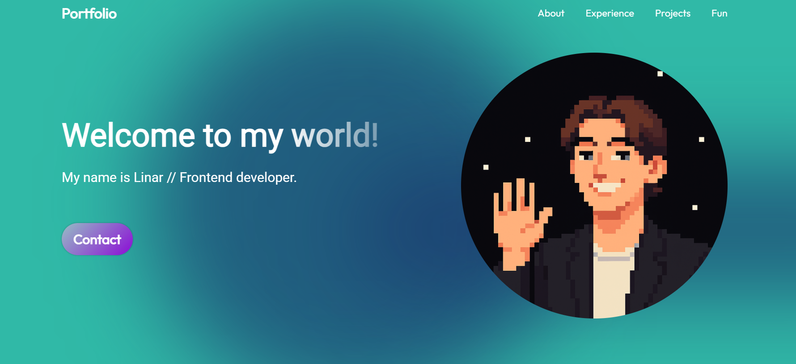

### Contact Button
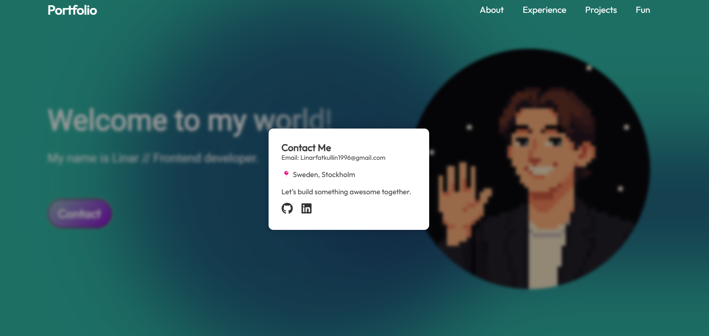

### About Section
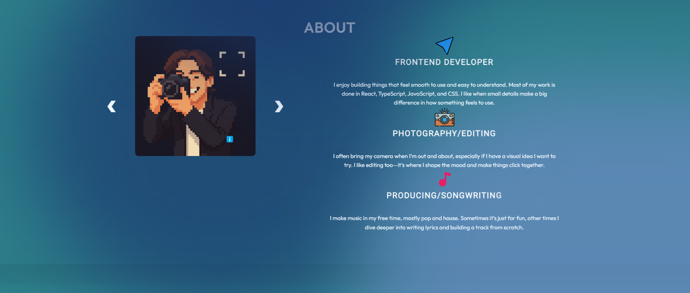

### Experience Section
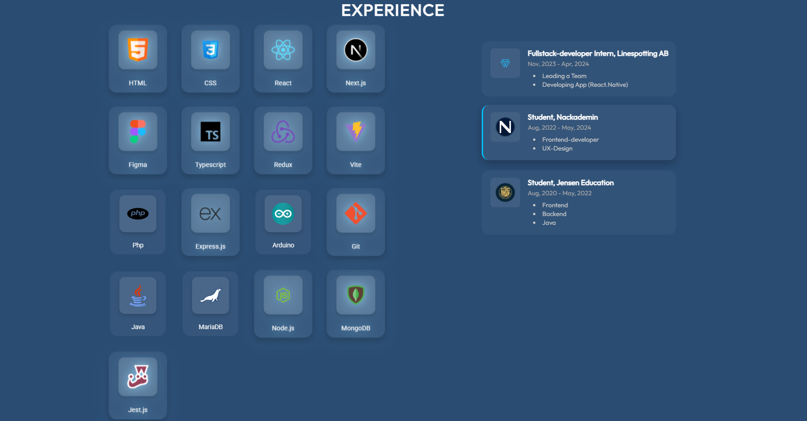

### Experience Section
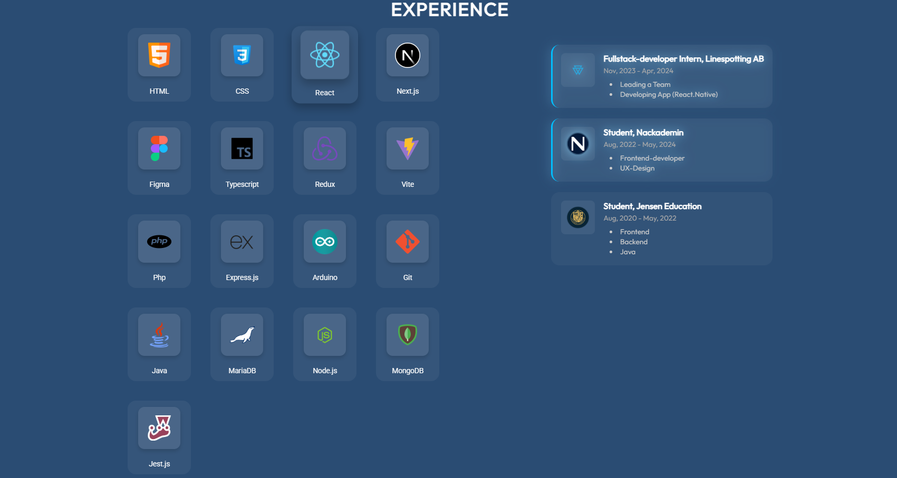

### Projects Section
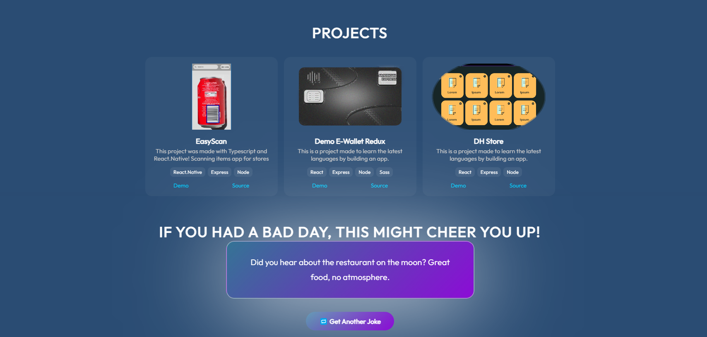

--------------------------------------------------------------------------------------------------------------

## 📷 Screenshots Mobile

### Homepage
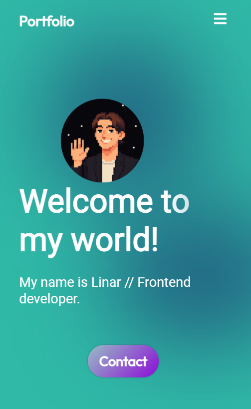

### Home NavBar
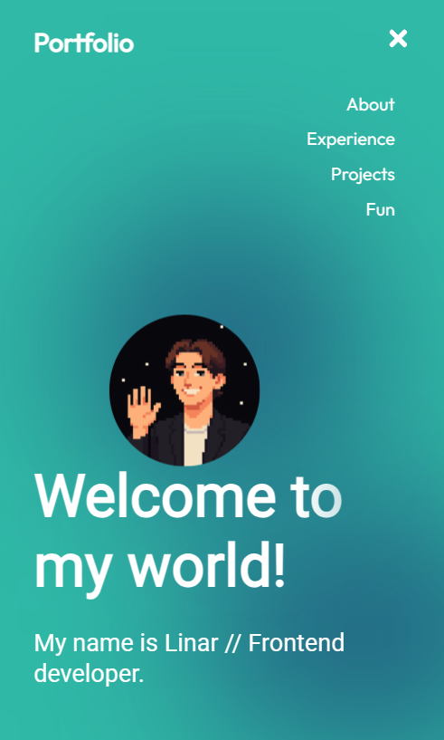

### About Section
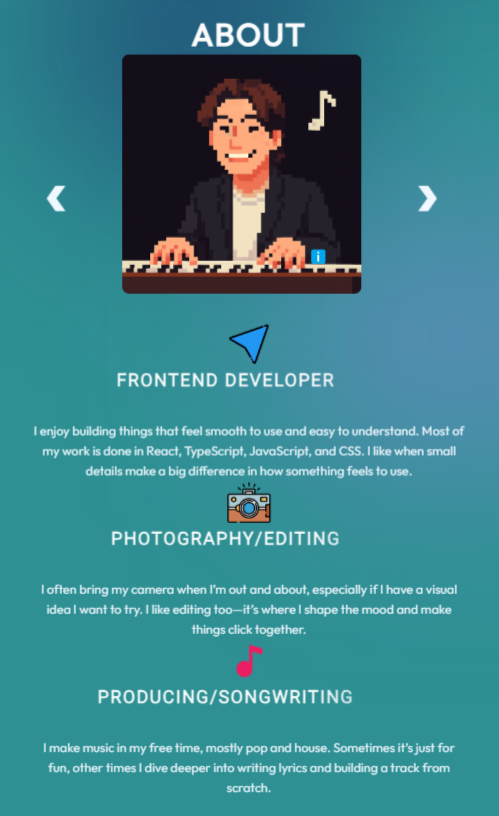

### Experience Section
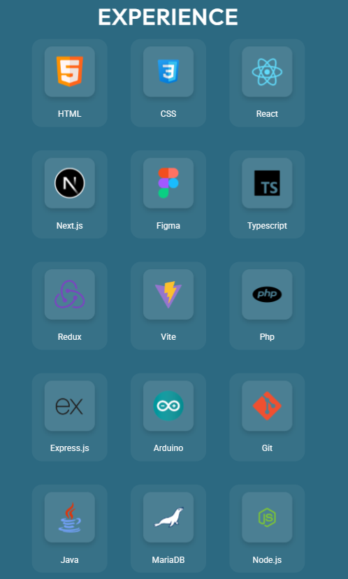

### Projects Section
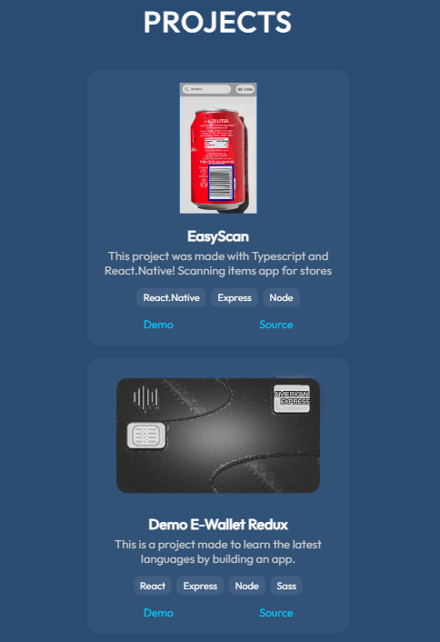

### Jokes Section

------------------------------------------------------------------------------------------------------------

